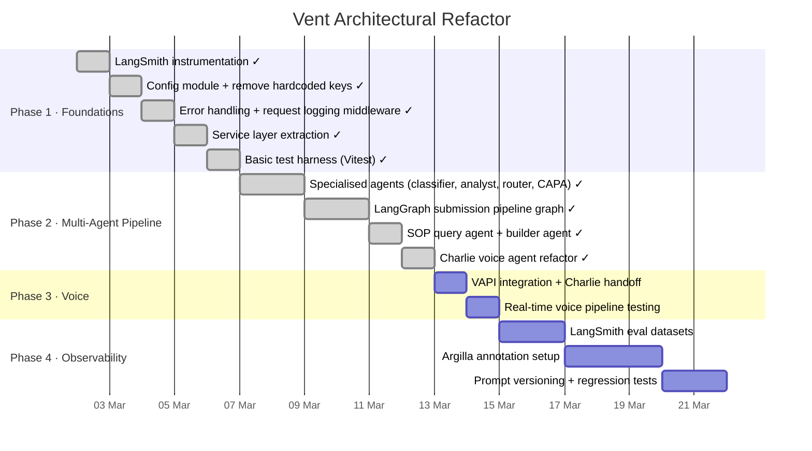
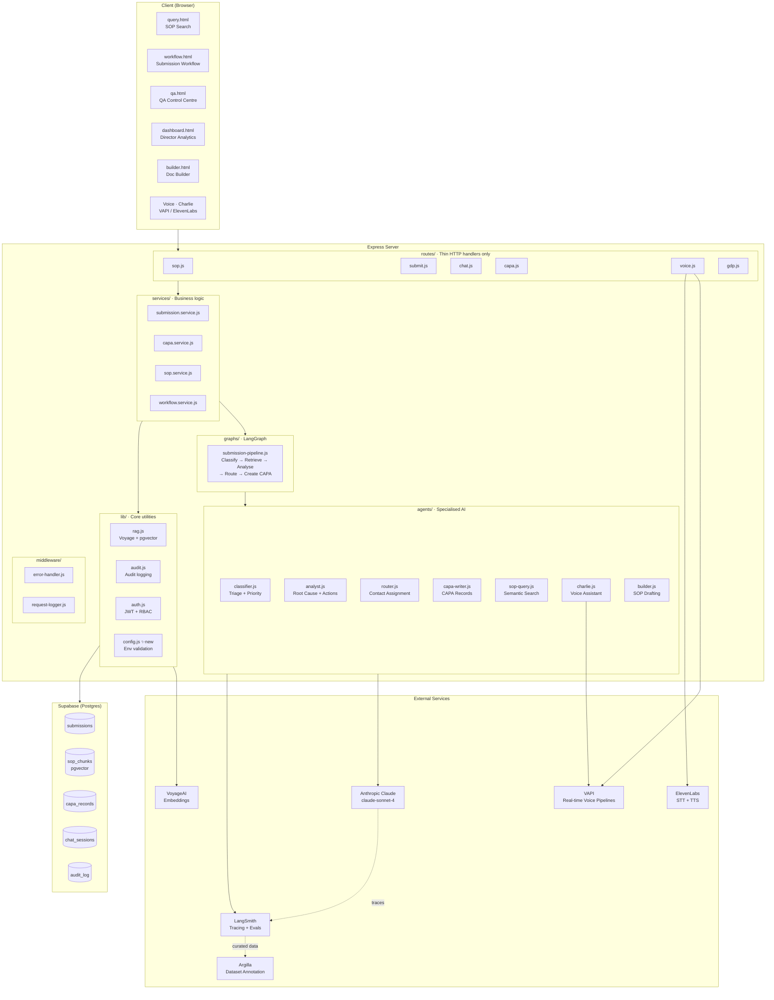

# Vent — Refactor Roadmap & Architecture

> Living document tracking the architectural refactor from prototype to production-grade system.
> Started: March 2026

---

## Progress Tracker



---

## Target System Architecture



---

## What Each Phase Does

### Phase 1 — Foundations
*Goal: Stop flying blind. Make the codebase behave like professional software.*

| Task | What it does | Why it matters |
|---|---|---|
| **LangSmith instrumentation** | Wraps every Claude call with tracing | You can see exactly what every AI call costs, how long it takes, and what it returned. Essential for a regulated environment. |
| **Config module** | Validates all env vars at startup, removes hardcoded API keys | Right now a missing key silently fails mid-request. With a config module it fails loudly at boot. Also removes the hardcoded VoyageAI key in `rag.js`. |
| **Service layer** | Moves business logic out of route handlers | Routes should only handle HTTP (parse body, set status, send response). Services own the actual logic. This makes testing possible. |
| **Error + logging middleware** | Centralised error handler and structured request logs | Right now errors are scattered `console.error` calls. One middleware catches everything consistently. |
| **Test harness** | Vitest setup with a handful of unit tests on services | Proves the code actually works and catches regressions when you change things. |

---

### Phase 2 — Multi-Agent Pipeline
*Goal: Replace "one Big Claude doing everything" with a graph of specialised agents.*

**Current state:** A single massive Claude call in your submission route handles triage, root cause, SOP cross-referencing, CAPA generation, and contact routing all at once. One prompt, one response, no visibility into which step failed.

**Target state:** A LangGraph stateful graph where each node is a discrete agent with a single responsibility:

```
Submission arrives
      │
      ▼
ClassifierAgent ──── assigns priority + process area
      │
      ▼
RetrieverAgent ────── fetches relevant SOP chunks via RAG
      │
      ▼
AnalystAgent ────────  root cause hypothesis, risk, regulatory flags
      │
      ▼
RouterAgent ──────── assigns contacts, workflow phase, CAPA timing
      │
      ▼
CAPAAgent ─────────  generates structured CAPA records
      │
      ▼
 Saved to Supabase
```

Each node can be retried independently. Each has its own LangSmith trace. Human-in-the-loop pause points can be added between any two nodes (e.g., QA must approve before `CAPAAgent` fires). This maps directly onto your existing multi-phase workflow model.

---

### Phase 3 — Voice
*Goal: Replace the manually stitched ElevenLabs STT → Claude → ElevenLabs TTS chain with a proper real-time voice pipeline.*

**Current state:** Your `/charlie/ask` endpoint is request/response — operator speaks, browser records, sends base64 audio to your server, you call ElevenLabs STT, pass text to Claude, pass response to ElevenLabs TTS, return audio. Round-trip latency: 3-5 seconds minimum. No interruption handling.

**Target state:** [VAPI](https://vapi.ai) manages a persistent WebRTC session. Charlie becomes a VAPI assistant with a Claude backend. You get:
- Sub-300ms turn detection
- Natural interruption handling (operator can cut Charlie off mid-sentence)
- Built-in STT/TTS, or bring your own ElevenLabs voice
- Server-sent events for real-time transcripts
- A single `/vapi/webhook` endpoint on your server to handle tool calls

This is mostly a **reduction** in code, not an addition.

---

### Phase 4 — Observability & Evals
*Goal: Know whether your AI is actually good. Build the data flywheel.*

- **LangSmith eval datasets** — curate real submission inputs and expected outputs into evaluation sets. Run them automatically to catch prompt regressions.
- **Argilla** — the feedback data you're already collecting via your feedback routes gets annotated and curated into training/eval datasets. Over time this tells you exactly where the model is weak (wrong priority classification, bad contact routing, etc.).
- **Prompt versioning** — prompts live in version-controlled files, not inline strings. You can A/B test prompt changes against your eval sets before deploying.

---

## Current vs Target File Structure

```
server/
├── agents/                     ✨ new
│   ├── classifier.js
│   ├── analyst.js
│   ├── router.js
│   ├── capa-writer.js
│   ├── sop-query.js
│   ├── charlie.js
│   └── builder.js
├── graphs/                     ✨ new
│   └── submission-pipeline.js
├── services/                   ✨ new
│   ├── submission.service.js
│   ├── capa.service.js
│   ├── sop.service.js
│   └── workflow.service.js
├── middleware/                  ✨ new
│   ├── error-handler.js
│   └── request-logger.js
├── lib/
│   ├── config.js               ✨ new  — centralised env validation
│   ├── rag.js                  ✅ keep — already solid
│   ├── audit.js                ✅ keep
│   └── auth.js                 ✅ keep
├── routes/                     ♻️  thin down — HTTP only, no business logic
│   ├── auth.js
│   ├── admin.js
│   ├── submit.js
│   ├── sop.js
│   ├── capa.js
│   ├── gdp.js
│   ├── builder.js
│   ├── chat.js
│   ├── voice.js
│   └── feedback.js
├── data/
│   └── contacts.js             ✅ keep
└── index.js                    ♻️  wire in new middleware
```

---

## Key Decisions

| Decision | Choice | Rationale |
|---|---|---|
| Runtime | Node.js (stay) | No reason to split the stack for LangGraph.js |
| Agent framework | LangGraph.js | Has a proper JS SDK, traces to LangSmith natively, fits your stateful submission pipeline exactly |
| Observability | LangSmith | First-party Anthropic/LangChain integration, minimal setup |
| Voice pipeline | VAPI | Managed WebRTC, handles STT/TTS, far less code than current approach |
| Dataset curation | Argilla | Best open-source tool for this; connects to LangSmith |
| Testing | Vitest | Fast, native ESM support, good DX |
| Model | Claude Sonnet 4 (keep) | Already using it; specialised agents means smaller prompts = cheaper per call |

---

*Update this document as phases complete. Check off tasks in the Gantt by moving their start dates to match actual progress.*
